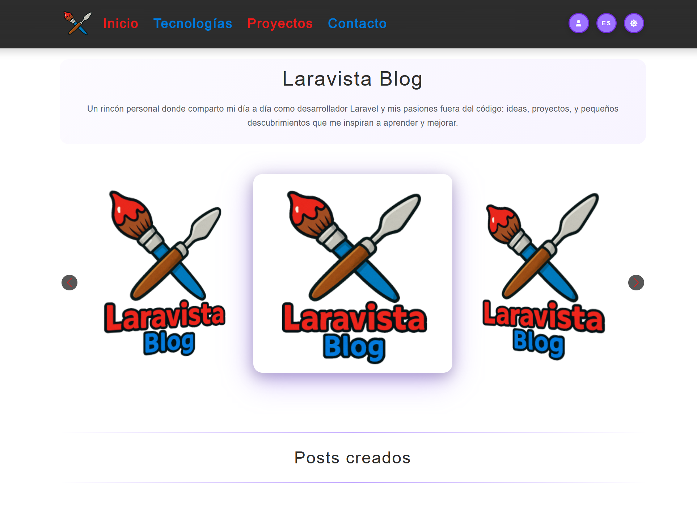
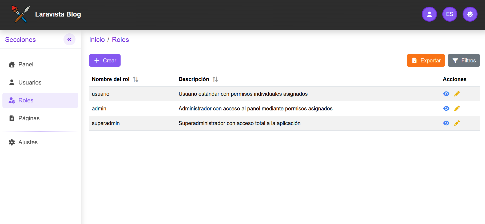

<p align="center">
  
</p>

<h1 align="center">Laravista Blog</h1>

Sitio web personal multilingüe (español / inglés / japonés) con un panel de
administración desde el que se gestiona todo el contenido público sin tocar código.
Está diseñado para ser **responsive**, de modo que se puede usar en cualquier
dispositivo (escritorio, móvil y tablet).

## Objetivo

El objetivo de Laravista Blog es disponer de una **página web personal** en la que,
**sin tocar código**, se pueda:

- **Modificar la parte pública** — editar páginas, textos e imágenes de cada bloque.
- **Añadir apartados de configuración** desde el panel. Actualmente incluye el
  **control de usuarios y roles**, y a futuro se contempla poder **poner la web en
  mantenimiento**, **ver información del servidor**, etc.

## ¿Qué puede hacer este proyecto?

El proyecto tiene dos caras: la **web pública** que ven los visitantes y el
**panel** privado desde el que se administra todo.

### Público

<p align="center">
  
</p>

- **Páginas compuestas por bloques** — cada página (inicio, créditos,
  tecnologías, proyectos, contacto) se monta con bloques de contenido: textos,
  imágenes, carruseles, tablas, botones… Ver [docs/paginas.md](docs/paginas.md).
- **Multilingüe (es / en / ja)** — todo el contenido y las URLs se muestran en
  los tres idiomas según el que elija el visitante.

### Panel

<p align="center">
  
</p>

- **Acceso protegido** — autenticación con roles y permisos por acción.
- **Edición de páginas y bloques** — se cambian los textos e imágenes de cada
  bloque, se activan/desactivan páginas y se previsualiza el resultado en vivo.
  Ver [docs/paginas.md](docs/paginas.md).
- **Gestión de usuarios** — listado con búsqueda, filtros, ordenación,
  exportación a Excel y borrado recuperable.
- **Control de usuarios y roles** — gestión de permisos por acción para
  decidir qué puede hacer cada usuario dentro del panel.
- **Gestión de archivos e imágenes** — subida de imágenes asociadas a los
  bloques (carruseles, iconos, fotos) almacenadas de forma ordenada.

## Seguridad

- **Exportación a Excel securizada** — los valores exportados se sanean para
  evitar la inyección y ejecución de fórmulas (CSV/Formula injection).
- **Subida de imágenes securizada** — se valida el tipo real del archivo
  comprobando su MIME type, no solo la extensión.

## Mejoras futuras

- **Revisar la accesibilidad de la web** — auditar la parte pública y el panel
  para garantizar el cumplimiento de WCAG 2.1 AA (HTML semántico, jerarquía de
  headings, atributos ARIA, contraste, foco visible y navegación por teclado).
- **Mejorar la velocidad de carga de la web** — optimizar tiempos de carga
  (imágenes, assets, caché y consultas) para reducir el peso de las páginas y
  acelerar la respuesta tanto en el público como en el panel.
- **Convertir las imágenes subidas a WebP** — transformar a formato WebP las
  imágenes que se guardan para reducir su tamaño en el servidor y acelerar la
  carga de la web.
- **Implementar CI/CD con Git** — configurar despliegues automáticos al servidor
  donde se alojará la web (actualmente el proyecto no está subido a ningún sitio).

## Documentación detallada

Cada funcionalidad se explica en su propio documento dentro de `docs/`:

### Público

- [Páginas](docs/paginas.md)

### Panel

- [Páginas](docs/paginas.md)

## Laravel

El proyecto está construido sobre **Laravel 13** (PHP 8.3+). El stack completo
es: PHP 8.3+ · Laravel 13 · Livewire 4 · Bootstrap 5.3 + Tailwind 4 · Vite ·
MySQL/MariaDB · PHPUnit 12.

Además del propio framework, utiliza las siguientes librerías que **no son
propias de Laravel**:

- **livewire/livewire** — componentes reactivos sin escribir JavaScript.
- **mcamara/laravel-localization** — rutas y contenido multilingües (es / en / ja).
- **spatie/laravel-permission** — roles y permisos por acción.
- **spatie/laravel-medialibrary** — gestión de archivos e imágenes asociadas a modelos.
- **spatie/laravel-translatable** — atributos de modelo traducibles.
- **maatwebsite/excel** — exportación de listados a Excel.
- **diglactic/laravel-breadcrumbs** — migas de pan del panel.
- **fortawesome/font-awesome** — iconografía.
- **twbs/bootstrap** — framework CSS del panel y la parte pública.

Y en el frontend (npm):

- **bootstrap** — estilos y componentes.
- **swiper** — carruseles de la parte pública.
- **tailwindcss** — utilidades CSS.
- **@fortawesome/fontawesome-free** — iconos.

## Puesta en marcha

```bash
composer install
npm install
cp .env.example .env
php artisan key:generate
php artisan migrate:fresh --seed   # crea tablas y datos de ejemplo
php artisan test                   # prueba en entorno de desarrollo
```
